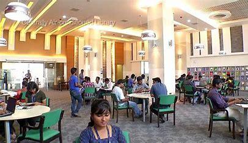

# Day1 - assignment 2 Collegeb site

# Index Page :
```html
<!DOCTYPE html>
<html lang="en">
<head>
    <meta charset="UTF-8">
    <meta name="viewport" content="width=device-width, initial-scale=1.0">
    <title>VIT | Site</title>
</head>
<body>
    <header>
         
        <nav>
            <ul>
                <li>
                    <a href="Home.html">Home page</a>
                </li>
                <li>
                    <a href="academics.html">Academics page</a>
                </li>
                <li>
                    <a href="admission.html">Admission page</a>
                </li>
                <li>
                    <a href="gallery.html">Gallery page</a>
                </li>
                
            </ul>
        </nav>
        <div>
            <h2>Welcome to College Name</h2>
            <p>Welcome to our esteemed institution, where we offer a holistic education experience. Our college is committed to providing quality education and fostering the intellectual and personal growth of our students.</p>
            <p>Our college offers a range of courses across Arts, Science, and Commerce streams. Explore our website to learn more about our academic offerings, admission process, and vibrant campus life.</p>
        </div>


    </header>
</body>
</html>


```
# Output


# Home page:
```html
<!DOCTYPE html>
<html lang="en">
<head>
    <meta charset="UTF-8">
    <meta name="viewport" content="width=device-width, initial-scale=1.0">
    <title>Home</title>
</head>
<body>
    <header>
        
       <nav>
           <ul>
               <li>
                   <a href="index.html">Home page</a>
               </li>
               <li>
                   <a href="academics.html">Academics page</a>
               </li>
               <li>
                   <a href="admission.html">Admission page</a>
               </li>
               <li>
                   <a href="gallery.html">Gallery page</a>
               </li>
               
           </ul>
       </nav>
       <main>
            <dl>
                <dt><strong>RANKING AND RECOGNITION</strong></dt>
                <dd>
                    <ul>
                        <li>VIT National & Global Rankings</li>
                        <li> VIT 212th Best Institution of the world in the Engineering and Technology</li>
                        <li> VIT is one among the top 5-8 in india and within 701-800 universities of the world as per Shanghai ARWU (Academic Ranking of World Universities) 2023</li>
                    </ul>
                </dd>
            </dl>

            <dl>
                <dt><strong>RELATIONS</strong> </dt>
                <dd>
                    <ul>
                        <li>VIT has a strong international presence across the world and academic partnerships with over 440 foreign universities.</li>
                        <li> VIT provides options to study 2 years at VIT and 2 years at a partner foreign university. </li>
                        <li> One may also study a semester abroad or engage in international research collaboration activities with partners.</li>
                    </ul>
                </dd>
            </dl>

            <dl>
                <dt><strong>PLACEMENTS</strong> </dt>
                <dd>
                    <ul>
                        <li>2409+ Dream Offers, 2027+ Super Dream Offers</li>
                        <li> 873+ Dream & Super Dream Internship offers </li>
                        <li> 1798+ Regular Offers</li>
                        <li> 12508+ Over all Offers</li>
                        <li>Limca Book of Records for the 10th time for unbeatable placement records.</li>
                        <li>771 Number of Companies </li>

                    </ul>
                </dd>
            </dl>
    </main>
   
</body>
</html>


```
# Output:


# Academics page:
```html
<!DOCTYPE html>
<html lang="en">
<head>
    <meta charset="UTF-8">
    <meta name="viewport" content="width=device-width, initial-scale=1.0">
    <title>VIT | Site</title>
</head>
<body>
    <header>
         
        <nav>
            <ul>
                <li>
                    <a href="Home.html">Home page</a>
                </li>
                <li>
                    <a href="academics.html">Academics page</a>
                </li>
                <li>
                    <a href="admission.html">Admission page</a>
                </li>
                <li>
                    <a href="gallery.html">Gallery page</a>
                </li>

                
            </ul>
        </nav>
        <div class="container">
            <h2>Academics</h2>
            <ul>
                <li>Arts
                    <ul>
                        <li><a href="courses/english.html">English</a></li>
                        <li><a href="courses/sociology.html">Sociology</a></li>
                    </ul>
                </li>
                <li>Science
                    <ul>
                        <li><a href="courses/computerScience.html">Computer Science</a></li>
                        <li><a href="courses/mathematics.html">Mathematics</a></li>
                    </ul>
                </li>
                <li>Commerce
                    <ul>
                        <li><a href="courses/economics.html">Economics</a></li>
                        <li><a href="courses/business-management.html">Business Management</a></li>
                    </ul>
                </li>
            </ul>
        </div>
        


    </header>
</body>
</html>
```
# output:


# Admission page:
```html
<!DOCTYPE html>
<html lang="en">
<head>
    <meta charset="UTF-8">
    <meta name="viewport" content="width=device-width, initial-scale=1.0">
    <title>VIT | Site</title>
</head>
<body>
    <header>
         
        <nav>
            <ul>
                <li>
                    <a href="Home.html">Home page</a>
                </li>
                <li>
                    <a href="academics.html">Academics page</a>
                </li>
                <li>
                    <a href="admission.html">Admission page</a>
                </li>
                <li>
                    <a href="gallery.html">Gallery page</a>
                </li>
                
            </ul>
        </nav>
        <div class="container">
            <h2>Admission Form</h2>
            <form action="/submit-admission" method="post">
                <label for="name">Name:</label>
                <input type="text" id="name" name="name" required><br><br>
    
                <label for="dob">Date of Birth:</label>
                <input type="date" id="dob" name="dob" required><br><br>
    
                <label for="email">Email:</label>
                <input type="email" id="email" name="email" required><br><br>
    
                <label for="phone">Phone:</label>
                <input type="tel" id="phone" name="phone" required><br><br>
    
                <label for="address">Address:</label>
                <textarea id="address" name="address" required></textarea><br><br>
    
                <label for="department">Department:</label>
                <select id="department" name="department" required>
                    <option value="arts">Arts</option>
                    <option value="science">Science</option>
                    <option value="commerce">Commerce</option>
                </select><br><br>
    
                <label for="course">Course:</label>
                <select id="course" name="course" required>
                    <option value="english">English</option>
                    <option value="sociology">Sociology</option>
                    <option value="computer-science">Computer Science</option>
                    <option value="mathematics">Mathematics</option>
                    <option value="economics">Economics</option>
                    <option value="business-management">Business Management</option>
                </select><br><br>
    
                <input type="submit" value="Submit">
            </form>
        </div>


    </header>
</body>
</html>

```
# output:


# Gallery Page:
```html
<!DOCTYPE html>
<html lang="en">
<head>
    <meta charset="UTF-8">
    <meta name="viewport" content="width=device-width, initial-scale=1.0">
    <title>VIT | Site</title>
</head>
<body>
    <header>
         
        <nav>
            <ul>
                <li>
                    <a href="Home.html">Home page</a>
                </li>
                <li>
                    <a href="academics.html">Academics page</a>
                </li>
                <li>
                    <a href="admission.html">Admission page</a>
                </li>
                <li>
                    <a href="gallery.html">Gallery page</a>
                </li>
                
            </ul>
        </nav>
        <div class="container">
            <h2>Gallery</h2>
            <div>
                
                
                
                
                
                
            </div>
        </div>

    </header>
</body>
</html>
```
# Output:


